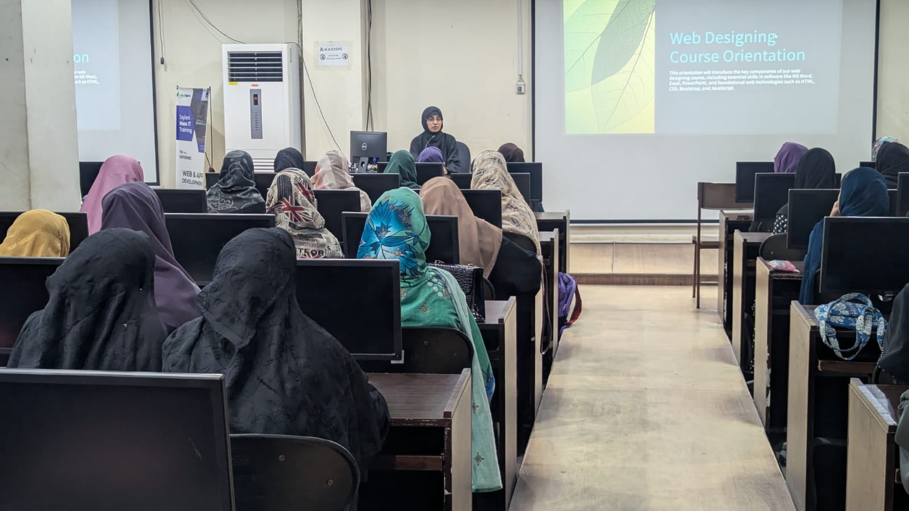

# Web Designing Batch 03

##  Course Overview

Welcome to the **Web Designing Batch 03** course!  
This 4-month course covers essential tools and technologies to kickstart your journey into web design and development.

---

## 🗂 Course Outline

### 1. Microsoft Office Suite
- MS Word  
- MS Excel  
- MS PowerPoint  

### 2. Web Technologies
- HTML  
- CSS  
- JavaScript  
- Bootstrap  

---

## Schedule

### Web Designing

| Days                            | Class Focus  | Completed Sections                                       |
|---------------------------------|--------------|----------------------------------------------------------|
| Day 01: Wednesday, 07/05/2025   | Orientation  | Demo: MS Word, Excel, PowerPoint, HTML, CSS,
| Day 02: Wednesday, 14/05/2025   | Ms Word      | Home Section
| Day 03: Wednesday, 21/05/2025   | Ms Word      | Insert Section
| Day 04: Wednesday, 28/05/2025   | Ms Word      | Layout Section
| Day 05: Wednesday, 04/06/2025   | Ms Word , Ms PowerPoint      | Reference Section , Intro Powerpoint
| Day 06: Wednesday, 11/06/2025   | Ms PowerPoint      | How to create a ChatBot
| Day 07: Wednesday, 18/06/2025   | Ms Excel      | Home page and formula
| Day 08: Wednesday, 25/06/2025   | Ms Excel      | Pivot Table , flash fill , data entry table

